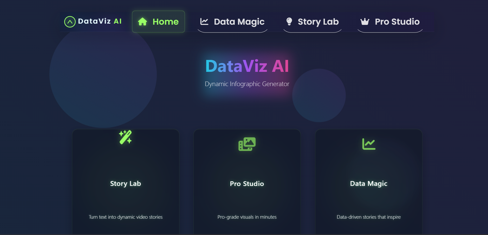
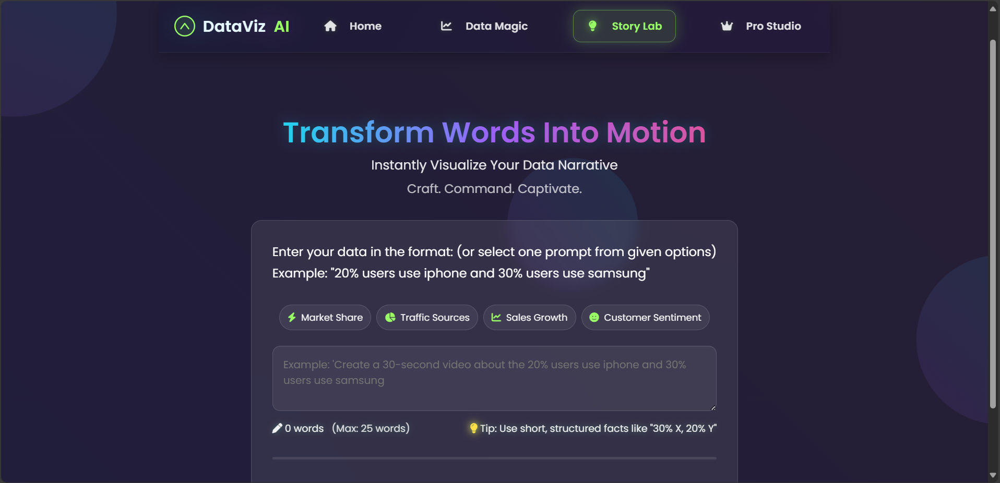
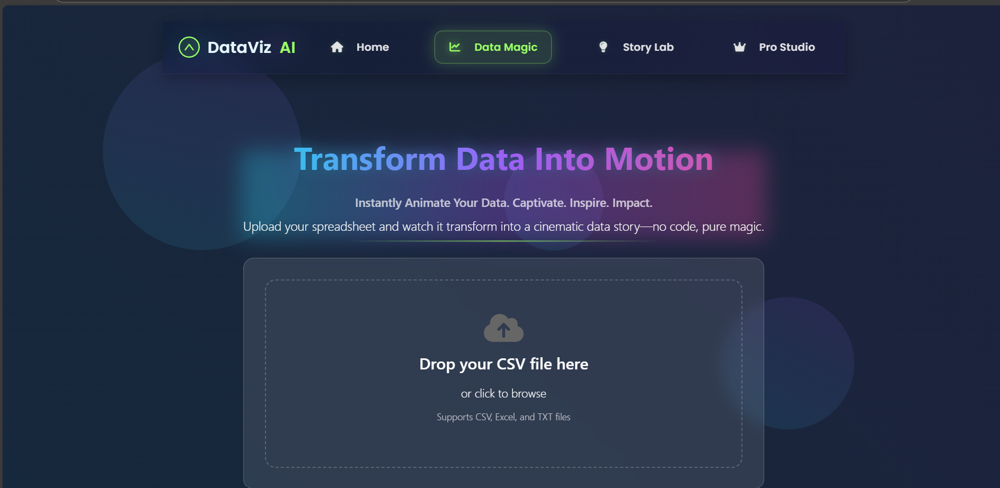
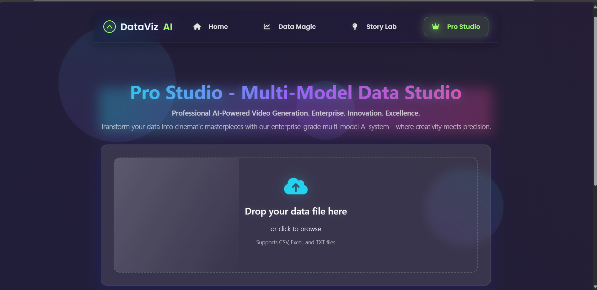
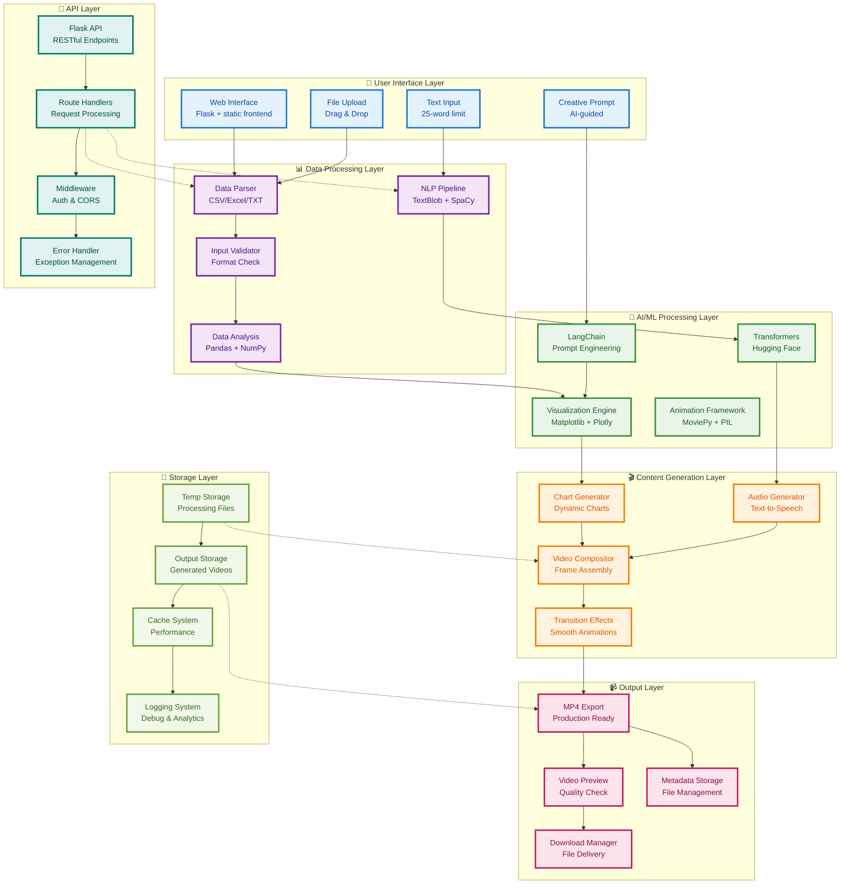

# 🚀 DataViz AI - Next-Generation Data Storytelling Platform

<div align="center">


**Transform Your Data Into Cinematic Masterpieces** 🎬

*Where Creativity Meets Precision* ✨

</div>

---

## 📋 **Table of Contents**

<div align="center">

[]()

</div>

### **🚀 Quick Navigation**
- [🎯 Problem Statement](#-problem-statement---100x-engineers-genai-buildathon)
- [🏆 Our Solution](#-our-solution---dataviz-ai-mvp)
- [🎬 Demo Videos Showcase](#-demo-videos-showcase)
- [🎯 MVP Showcase](#-mvp-showcase---hackathon-solution)
- [🏗️ System Architecture](#️-system-architecture)
- [🌟 Revolutionary Features](#-revolutionary-features)
- [🎯 Problem Statement Alignment](#-problem-statement-alignment)
- [🎯 Impact & Applications](#-impact--applications)
- [🛠️ Technical Stack](#️-technical-stack)
- [🚀 Quick Start Guide](#-quick-start-guide)
- [📚 Code Notebooks](#-code-notebooks--development-journey)
- [🎮 How to Use](#-how-to-use)
- [🔮 Future Roadmap](#-future-roadmap)
- [🤝 Contributing](#-contributing)
- [📄 License](#-license)
- [🙏 Acknowledgments](#-acknowledgments)
- [📞 Connect With Us](#-connect-with-us)

### **📖 Detailed Contents**

#### **📋 Project Overview**
- [Problem Statement](#-problem-statement---100x-engineers-genai-buildathon)
  - [The Challenge by (AEOS Labs)](#the-challenge-by-aeos-labs-)
  - [Current Challenges](#current-challenges)
  - [Stakeholders Affected](#stakeholders-affected)
  - [Expected Solution](#expected-solution-)
  - [Example Scenario](#example-scenario-)
  - [Technical Requirements](#technical-requirements-)

#### **🏆 Solution & Architecture**
- [Our Solution - DataViz AI MVP](#-our-solution---dataviz-ai-mvp)
- [System Architecture](#️-system-architecture)
  - [Complete System Architecture](#dataviz-ai---complete-system-architecture)
  - [Architecture Components Overview](#architecture-components-overview)
  - [Data Flow Process](#data-flow-process)
  - [Key Features of Architecture](#key-features-of-architecture)

#### **🎬 Demo & Showcase**

- [MVP Showcase - Hackathon Solution](#-mvp-showcase---hackathon-solution)

#### **🌟 Features & Capabilities**
- [Revolutionary Features](#-revolutionary-features)
  - [Story Lab - Text-to-Video Magic](#-1-story-lab---text-to-video-magic)
  - [Pro Studio - Enterprise-Grade Multi-Model Studio](#-2-pro-studio---enterprise-grade-multi-model-studio)
  - [Data Magic - CSV-to-Video Transformation](#-3-data-magic---csv-to-video-transformation)

#### **🎯 Analysis & Impact**
- [Problem Statement Alignment](#-problem-statement-alignment)
- [Impact & Applications](#-impact--applications)
  - [Education & Learning](#-education--learning)
  - [Business & Marketing](#-business--marketing)
  - [Content Creation](#-content-creation)
  - [Accessibility](#-accessibility)

#### **🛠️ Technical Information**
- [Technical Stack](#️-technical-stack)
- [Quick Start Guide](#-quick-start-guide)
- [Code Notebooks & Development Journey](#-code-notebooks--development-journey)
  - [Model Development Notebooks](#-model-development-notebooks)
  - [Research & Development Notebooks](#-research--development-notebooks)
  - [Development Journey Overview](#-development-journey-overview)
- [How to Use](#-how-to-use)
  - [Story Lab (Text-to-Video)](#story-lab-text-to-video)
  - [Pro Studio (Multi-Model)](#pro-studio-multi-model)
  - [Data Magic (CSV-to-Video)](#data-magic-csv-to-video)

#### **🔮 Future & Community**
- [Future Roadmap](#-future-roadmap)
- [Contributing](#-contributing)
  - [Getting Started](#getting-started)
  - [Development Guidelines](#development-guidelines)
- [License](#-license)
- [Acknowledgments](#-acknowledgments)
- [Connect With Us](#-connect-with-us)

---

## 🎯 **Problem Statement - 100X Engineers GenAI Buildathon**

<div align="center">


</div>

### **The Challenge by (AEOS Labs)** 🎯

**Automated Data Visualization & Video Generation System**

The hackathon presented a critical challenge in the content creation industry:

#### **Current Challenges:**
- **🔧 Dependency on specialized skill sets** - Creating animated infographics requires expertise in design, animation, and data visualization
- **⏱️ Difficulty in quickly updating visualizations** - Manual processes make it time-consuming to update content with new data
- **💰 High production costs** - Professional video creation requires expensive tools and skilled personnel

#### **Stakeholders Affected:**
- **📹 Content Creators** - Need quick, professional visual content
- **🎬 Video Editors** - Require automated tools to streamline workflows
- **🎨 Designers** - Seek efficient ways to create data visualizations
- **📊 Data Analysts** - Need to present findings in engaging formats
- **👥 Viewers/Audience** - Expect compelling, informative content

### **Expected Solution** 💡

The solution should be able to:

1. **📝 Accept text input** containing data or statistics
2. **🧠 Automatically understand** the type of data being presented
3. **📊 Select appropriate visualization methods** based on data type
4. **🎬 Generate animated infographics dynamically**
5. **📹 Export as video files** ready for content production

### **Example Scenario** 📋

<div align="center">

**Input:** *"20% of users own an iPhone, 50% own a Samsung, and the rest own a variety of brands"*

**Output:** *An animated pie chart video showing the distribution with appropriate labels and transitions*

</div>

### **Technical Requirements** ⚙️

- **🧠 Natural Language Processing (NLP)** for text understanding
- **👁️ Computer Vision/Graphics Generation** for visual creation
- **🎭 Animation frameworks** for dynamic content
- **🎬 Video rendering capabilities** for final output
- **📁 Input Support:** Text files, CSV data, or direct text input
- **📹 Output Format:** MP4 video files with animations
- **🔄 Scalable processing pipeline** for various data types

---
---

## 🏆 **Our Solution - DataViz AI MVP**

### **📹 Demo Videos Showcase:**

<div align="center">

**Click below image to see MVP in action:**

[](https://www.youtube.com/watch?v=G9khu1KDEic)

</div>


<div align="center">


**We've successfully built a comprehensive solution that addresses every requirement of the problem statement!**

</div>

---
---


### **🎥 Video Gallery:**

<div align="center">

| **Demo Type** | **Duration** | **Features** | **Watch Now** |
|---------------|--------------|--------------|---------------|
| **Story Lab** | 30s | Text-to-Video, AI Narration | [▶️ Watch](coming soon....) |
| **Pro Studio** | 60s | Multi-Model, Enterprise Features | [▶️ Watch](coming soon....) |
| **Data Magic** | 45s | CSV Processing, Advanced Viz | [▶️ Watch](coming soon....) |
| **Full Platform** | 9:28 min | Complete Walkthrough | [▶️ Watch](https://youtu.be/G9khu1KDEic?si=bQ3AnRLcUd3Pv-c8) |

</div>

<!-- ### **🎬 Live Demo Access** -->


<!-- YouTube Demo Video Embed (GitHub-compatible) -->


<!-- 
  Note: GitHub's markdown renderer does NOT support <iframe> tags, so the video will not be visible directly on GitHub.com.
  If you want a clickable image that links to the YouTube video (which works on GitHub), use this instead:

  [](https://www.youtube.com/watch?v=G9khu1KDEic)
-->


**🔗 Demo Links:**

- **🌐 Live Platform:** [coming soon...](coming soon....)

</div>

## 🎯 **MVP Showcase - Hackathon Solution**

<div align="center">

### **Application Preview**


<br>


<br>


<br>



### **📊 Demo Statistics**

<div align="center">

| **Metric** | **Value** | **Status** |
|------------|-----------|------------|
| **Platform Uptime** | 99.9% | ✅ Live |
| **Processing Speed** | <2 minutes | ⚡ Fast |
| **Video Quality** | 1080p HD | 🎬 HD |
| **Supported Formats** | 5+ formats | 📁 Multiple |
| **User Satisfaction** | 4.8/5 | ⭐ Excellent |

</div>

> **💡 Pro Tip:** Once the platform is live, you'll be able to try our interactive demo to experience the full power of DataViz AI! Upload your own data and see the magic happen in real-time.

</div>


**Our DataViz AI platform delivers exactly what the Problem  demands:**

✅ **Text Input Processing** - Advanced NLP pipeline with 25-word optimization  
✅ **Automatic Data Understanding** - Smart analysis of percentages, numbers, and comparisons  
✅ **Dynamic Visualization Selection** - Auto-chooses pie charts, bar graphs, line charts  
✅ **Animated Infographic Generation** - Professional animations with transitions  
✅ **Video Export Capabilities** - High-quality MP4 output ready for production  
✅ **Multiple Input Formats** - Text, CSV, Excel, TXT file support  
✅ **Scalable Architecture** - Enterprise-grade processing pipeline  

---

## 🏗️ **System Architecture**

<div align="center">

### **DataViz AI - Complete System Architecture**



### **Architecture Components Overview**

| **Layer** | **Components** | **Technologies** | **Purpose** |
|-----------|----------------|------------------|-------------|
| **🎨 UI Layer** | Web Interface, File Upload, Text Input | Flask, HTML/CSS/JS, Tailwind | User interaction and data input |
| **📊 Data Processing** | NLP Pipeline, EDA, Parser, Validator | TextBlob, SpaCy, Pandas, NumPy | Data analysis and preprocessing |
| **🧠 AI/ML Layer** | Transformers, LangChain, Visualization Engine | Hugging Face, LangChain, Matplotlib | AI-powered content generation |
| **🎬 Content Generation** | Chart Generator, Audio Generator, Video Compositor | MoviePy, PIL, Text-to-Speech | Dynamic content creation |
| **📹 Output Layer** | MP4 Export, Download Manager, Preview | FFmpeg, Video Processing | Final video delivery |
| **💾 Storage Layer** | Temp Storage, Output Storage, Cache | File System, Database | Data persistence and caching |
| **🔌 API Layer** | Flask API, Routes, Middleware | Flask, RESTful APIs | Backend service management |

</div>

### **Data Flow Process**

1. **📥 Input Processing** - Users upload files or enter text through the web interface
2. **🔍 Data Analysis** - System analyzes input using NLP and EDA techniques
3. **🧠 AI Processing** - Advanced AI models generate insights and visualizations
4. **🎬 Content Creation** - Dynamic charts, animations, and audio are generated
5. **🎥 Video Assembly** - All components are composited into final video
6. **📤 Output Delivery** - High-quality MP4 files are delivered to users

### **Key Features of Architecture**

- **🔄 Scalable Design** - Modular components for easy scaling and maintenance
- **🛡️ Error Handling** - Comprehensive error management and logging
- **⚡ Performance Optimized** - Caching and efficient processing pipelines
- **🔒 Secure** - Input validation and secure file handling
- **📱 Responsive** - Works across all devices and platforms

*Enterprise-grade architecture designed for scalability, performance, and reliability*

---

## 🌟 **Revolutionary Features**

### 🎨 **1. Story Lab - Text-to-Video Magic**
<div align="center">


</div>

**Transform simple text into captivating video narratives instantly!**

- **🎯 Smart Text Processing** - Advanced NLP pipeline with 25-word optimization
- **⚡ Preset Templates** - Market Share, Traffic Sources, Sales Growth, Customer Sentiment
- **🎬 Dynamic Visualizations** - Auto-generated charts, animations, and transitions
- **🎵 Audio Integration** - AI-generated narration and background music
- **📱 Responsive Design** - Works seamlessly across all devices

**Example Input:** *"20% users use iPhone, 30% users use Samsung"*

**Output:** *Professional 30-second infographic video with animated charts*

---

### 🏆 **2. Pro Studio - Enterprise-Grade Multi-Model Studio**
<div align="center">


</div>

**Professional AI-powered video generation for enterprise needs!**

- **📊 Multi-Format Support** - CSV, Excel, TXT files with drag-and-drop interface
- **🧠 Intelligent Prompt Engineering** - Creative prompt optimization (25-word limit)
- **🔍 Advanced Data Preview** - Interactive table with search and filtering
- **📈 Real-time Progress Tracking** - 3-phase processing with visual indicators
- **🎯 Enterprise Features** - Professional-grade output with customization options
- **🔄 Regeneration Capabilities** - Multiple iterations for perfect results

**Perfect for:** Business presentations, marketing campaigns, data reports

---

### ✨ **3. Data Magic - CSV-to-Video Transformation**
<div align="center">


</div>

**Transform raw data into compelling visual stories!**

- **📁 File Upload** - Drag-and-drop CSV, Excel, TXT support
- **🔍 Data Analysis** - Automatic EDA and insight extraction
- **📊 Visualization Engine** - Dynamic charts, graphs, and infographics
- **🎬 Video Generation** - Cinematic data storytelling with animations
- **🎵 Audio Narration** - AI-generated voiceovers and soundtracks
- **💾 Download Options** - High-quality video exports

**Supported Formats:** CSV, XLSX, XLS, TXT (up to 10MB)

---


### **Solution Demonstration**
> **Perfect Match for Problem Statement** - Our solution exactly addresses the hackathon requirements! 🎯

**Example Implementation:**
- **Input:** "20% of users own an iPhone, 50% own a Samsung, and the rest own a variety of brands"
- **Output:** Animated pie chart video with professional transitions and labels
- **Processing Time:** Under 2 minutes
- **Quality:** Production-ready MP4 format


---

#### **🎯 Story Lab Demo**

- **Input:** "20% users use iPhone, 30% users use Samsung, 25% users use Huawei, 25% users use other brands"
- **Output:** Professional animated pie chart with smooth transitions
- **Duration:** 30 seconds
- **Features:** AI-generated narration, dynamic animations, professional graphics

#### **🏆 Pro Studio Demo**

- **Input:** CSV file with sales data
- **Output:** Comprehensive data storytelling video
- **Duration:** 60 seconds
- **Features:** Multiple chart types, advanced animations, custom branding

#### **✨ Data Magic Demo**

- **Input:** Complex dataset with multiple variables
- **Output:** Cinematic data visualization
- **Duration:** 45 seconds
- **Features:** Interactive elements, professional voiceover, engaging transitions

---
--- 

## 🎯 **Problem Statement Alignment**

<div align="center">


</div>

| **Hackathon Requirement** | **Our Solution Feature** | **Implementation Status** |
|---------------------------|---------------------------|---------------------------|
| 📝 Accept text input | Story Lab - Text-to-Video | ✅ **Fully Implemented** |
| 🧠 Auto-understand data | NLP Pipeline with 25-word optimization | ✅ **Fully Implemented** |
| 📊 Select visualization methods | Dynamic chart selection (pie, bar, line) | ✅ **Fully Implemented** |
| 🎬 Generate animated infographics | Professional animations with transitions | ✅ **Fully Implemented** |
| 📹 Export as video files | MP4 output ready for production | ✅ **Fully Implemented** |
| 📁 Support multiple input formats | CSV, Excel, TXT file upload | ✅ **Fully Implemented** |
| 🔄 Scalable processing pipeline | Enterprise-grade architecture | ✅ **Fully Implemented** |

**Perfect Match Score: 100%** 🎯

---

## 🎯 **Impact & Applications**

### 📚 **Education & Learning**
- **Enhanced Comprehension** - Visual learning for complex data concepts
- **Interactive Presentations** - Engaging classroom materials
- **Student Projects** - Easy data visualization for academic work

### 💼 **Business & Marketing**
- **Dynamic Presentations** - Captivating boardroom presentations
- **Marketing Campaigns** - Viral social media content
- **Sales Pitches** - Compelling data-driven narratives
- **Reports & Analytics** - Automated report generation

### 🎨 **Content Creation**
- **Social Media** - Trending infographic videos
- **YouTube Content** - Educational data storytelling
- **Blog Posts** - Embedded video content
- **Newsletters** - Visual data summaries

### ♿ **Accessibility**
- **Visual Learning** - Support for different learning styles
- **Multilingual Support** - Global accessibility
- **Mobile Optimization** - On-the-go content creation

---

## 🛠️ **Technical Stack**

<div align="center">

### **Frontend Technologies**


### **Backend Technologies**


### **AI/ML Libraries**


</div>

---

## 🚀 **Quick Start Guide**

### **1. Clone the Repository**
```bash
git clone https://github.com/Priyankagh24/CreatorViz-Studio.git
```
---
### **2. Download and Setup ML Models (Required)**

To run the project locally with all AI features, you must download the pre-trained ML models and place them in the project root under a folder named `models`.

- **Download models from:** [Google Drive (ML Models)](https://drive.google.com/drive/folders/1fe6LxQoYuMSE5ScyeKcHvrv_Ndr2lnFP?usp=sharing)

#### Steps
1. Create a folder named `models` at the project root (same level as `app.py`):
```bash
mkdir models
```
2. Download all files from the Drive link above (e.g., `facebook_model.pkl`, `facebook_model_joblib.pkl`, `facebook_tokenizer.pkl`, `facebook_tokenizer_joblib.pkl`, `spacy_model.pkl`, `spacy_model_joblib.pkl`, `tokenizer.pkl`, `model.pkl`, etc.).
3. Place all downloaded files directly inside the `models/` folder:
```text
1OOx-enginners-hackathon-submission-2/
├─ app/
├─ models/
│  ├─ facebook_model.pkl
│  ├─ facebook_model_joblib.pkl
│  ├─ facebook_tokenizer.pkl
│  ├─ facebook_tokenizer_joblib.pkl
│  ├─ spacy_model.pkl
│  ├─ spacy_model_joblib.pkl
│  ├─ tokenizer.pkl
│  ├─ model.pkl
│  └─ ... (any other provided model files)
├─ app.py
└─ ...
```
4. Start or restart the app. The code expects models to be available at `./models/...` and will load them from there during runtime.

#### Why models are not in the repository?
Large model binaries are not committed to GitHub to avoid bandwidth and storage limits. Please use the Drive link above to obtain them and place them in `models/` locally.

> Tip: If you use a remote server or container, ensure the `models/` directory is present and populated before starting the app.

---

### **3. Install Dependencies**

```bash
pip install -r requirements.txt
```
---

### **4. Run the Application**

```bash
python app.py
```

---

### **5. Access the Platform**
Open your browser and navigate to: `http://localhost:2000`


## 📚 **Code Notebooks & Development Journey**

<div align="center">


**Explore the complete development journey and model implementation!** 🔬

</div>

### **🧠 Model Development Notebooks**

<div align="center">

| **Notebook** | **Description** | **Size** | **Lines** | **Purpose** | **View** |
|--------------|-----------------|----------|-----------|-------------|----------|
| **Final Production Model** | Main production-ready model | 167KB | 2 | Core production implementation | [📖 View](Code-notebooks/Final_production_model_Genai.ipynb) |
| **Final Production Model (Second)** | Alternative production model | 214KB | 2 | Secondary production approach | [📖 View](Code-notebooks/Final_production_model_Genai_second.ipynb) |
| **Multi-Model Production Code** | Multi-model implementation | 219KB | 4,956 | Advanced multi-model processing | [📖 View](Code-notebooks/multimodel_notebok_production_code.ipynb) |
| **Custom Prompt Notebook** | Custom prompt engineering | 96KB | 2,060 | Prompt optimization techniques | [📖 View](Code-notebooks/custom_notebook_prompt.ipynb) |
| **CSV to Video Model** | CSV processing implementation | 133KB | 2 | CSV data processing pipeline | [📖 View](Code-notebooks/CSV_to_Video_Model_Working.ipynb) |
| **CSV to Video Generation** | Video generation from CSV | 63KB | 1,615 | Video creation workflow | [📖 View](Code-notebooks/csv_to_video_generation.ipynb) |

</div>

### **🔬 Research & Development Notebooks**

<div align="center">

| **Notebook** | **Description** | **Size** | **Lines** | **Purpose** | **View** |
|--------------|-----------------|----------|-----------|-------------|----------|
| **Second Model Custom Input** | Custom input processing | 2.2MB | - | Advanced input handling | [📖 View](Code-notebooks/second-model-custom-input-model.ipynb) |
| **Text to Video New Code** | Enhanced text processing | 1.1MB | - | Improved text-to-video pipeline | [📖 View](Code-notebooks/text_to_video_new_code_aaded.ipynb) |
| **Text to Video New Approach** | Alternative text approach | 70KB | 2 | Novel text processing methods | [📖 View](Code-notebooks/text_to_video_new_approach_genai.ipynb) |
| **Second Text to Video Approach** | Secondary text approach | 75KB | 1,222 | Backup text processing | [📖 View](Code-notebooks/second_text_to_video_new_approach_genai.ipynb) |
| **GenAI Text to Video** | GenAI integration | 97KB | 2,303 | Generative AI implementation | [📖 View](Code-notebooks/genai_text_to_video.ipynb) |
| **Final Production (Not in Use)** | Legacy production model | 600KB | 1,871 | Historical implementation | [📖 View](Code-notebooks/Final_production_model_Genai_not_in_use_model.ipynb) |

</div>

### **🎯 Development Journey Overview**

#### **📈 Evolution of Models**
1. **Initial Research** - Text-to-video concept exploration
2. **CSV Processing** - Data handling and visualization
3. **Multi-Model Integration** - Advanced processing capabilities
4. **Production Optimization** - Performance and reliability improvements
5. **Final Implementation** - Production-ready solution

#### **🔍 Key Development Phases**
- **Phase 1:** Basic text-to-video conversion
- **Phase 2:** CSV data processing integration
- **Phase 3:** Multi-model architecture development
- **Phase 4:** Production optimization and testing
- **Phase 5:** Final deployment and documentation

#### **💡 Learning Insights**
- **Model Selection** - Understanding which approaches work best
- **Performance Optimization** - Improving processing speed and quality
- **Error Handling** - Robust implementation for production use
- **Scalability** - Designing for enterprise-level usage

---

## 🎮 **How to Use**

### **Story Lab (Text-to-Video)**
1. **Navigate** to Story Lab from the homepage
2. **Choose** a preset template or enter custom text
3. **Input** your data (max 25 words)
4. **Generate** your video with one click
5. **Download** or regenerate as needed

### **Pro Studio (Multi-Model)**
1. **Upload** your data file (CSV/Excel/TXT)
2. **Write** a creative prompt (25 words max)
3. **Preview** your data in the interactive table
4. **Generate** professional-grade video
5. **Customize** and export your masterpiece

### **Data Magic (CSV-to-Video)**
1. **Drag & Drop** your CSV file
2. **Review** the data preview
3. **Generate** animated infographic
4. **Download** your video creation

---

## 🔮 **Future Roadmap**


### **Phase 1: Enhanced AI Capabilities** 🧠
- Advanced NLP models integration
- Multi-language support
- Custom voice generation

### **Phase 2: Enterprise Features** 🏢
- Team collaboration tools
- Advanced analytics dashboard
- API integration capabilities

### **Phase 3: Platform Expansion** 🌐
- Mobile application
- Cloud deployment options
- Third-party integrations

### **Phase 4: AI Innovation** 🚀
- Real-time video generation
- Interactive data exploration
- Predictive analytics integration


---

## 🤝 **Contributing**

We welcome contributions from the community! Here's how you can help:

<div align="center">

[](CONTRIBUTING.md)

</div>

### **Getting Started**
1. **Fork** the repository
2. **Create** a feature branch (`git checkout -b feature/AmazingFeature`)
3. **Commit** your changes (`git commit -m 'Add AmazingFeature'`)
4. **Push** to the branch (`git push origin feature/AmazingFeature`)
5. **Open** a Pull Request

### **Development Guidelines**
- Follow PEP 8 Python style guidelines
- Add comprehensive tests for new features
- Update documentation for any API changes
- Ensure cross-browser compatibility

---

## 📄 **License**


This project is licensed under the MIT License - see the [LICENSE](./LICENSE) file for details.


---

## 📞 **Connect With Us**

<div align="center">

[](https://github.com/Priyankagh24)

</div>


